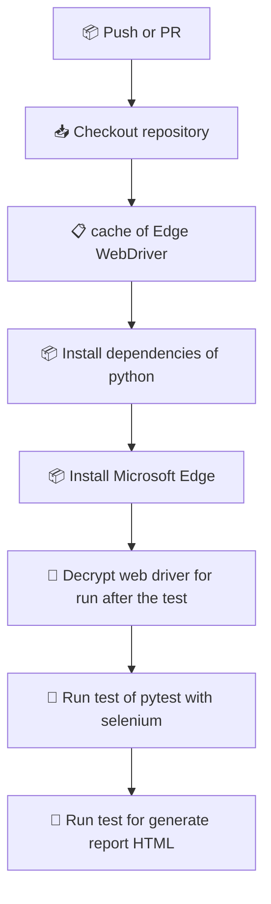

# 🧪 Test Selenium

This project contains automated tests using **Selenium WebDriver** to validate the features of a web application. It is designed to facilitate the execution of functional tests in different browsers and environments.
## 🚀 Characteristics

- Test automation with Selenium WebDriver
- Modular structure to facilitate maintenance and scalability
- Support for multiple browsers
- Integration with CI/CD tools (ideal for GitHub Actions)
- Easy local setup and execution

## 🛠️ Technologies used
- Python 3.x
- Selenium
- WebDriver Manager
- pytest (optional to structure tests)
- GitHub Actions (for CI)


## 📦 Instalation

```bash
# Clona el repositorio
git clone https://github.com/RenzoMedina/test-selenium.git
cd test-selenium
```
## 🧪 Execution of tests

```bash
  pytest
```


## 📁 Structure

```text
test-selenium/
├── assets/
├── src/               
├── tests/               
│   └── first_test.py    
├── requirements.txt      
└── README.md             
```

## 📊  GitHub Actions 

## 👨‍💻 Autor

Renzo Steven Medina Olaya
Backend Developer transitioning into DevOps

